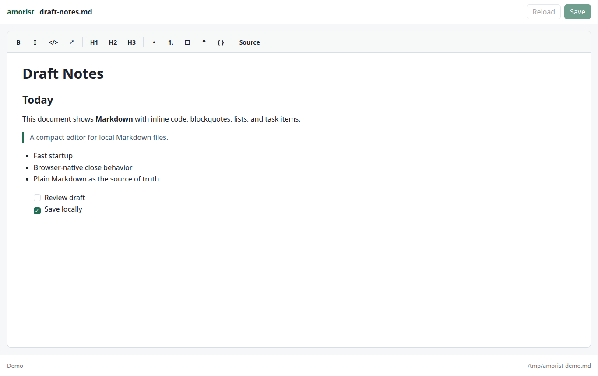

# amorist

Fast local Markdown editing with a small browser-based runtime.

amorist opens one Markdown file at a time from the shell:

```bash
amorist file.md
```

The command starts a private server on `127.0.0.1`, opens the editor in your browser, and saves directly back to the file you passed in. The editor is a small vanilla JavaScript component built for this project, so Markdown stays the source of truth and the runtime has no Node, Rust, WebKitGTK, or Electron dependency chain.



## Features

- Opens `.md`, `.markdown`, and `.mdown` files from the command line.
- Saves directly to the same local file with `Ctrl+S` or the Save button.
- Keeps existing `LF` or `CRLF` line endings when saving.
- Shows a browser-native warning before closing with unsaved changes.
- Stops the local server automatically after the browser tab is closed.
- Supports headings, emphasis, links, code, lists, blockquotes, fenced code blocks, and task lists.
- Rejects files larger than 10 MB before reading.

Markdown tables are rendered as plain Markdown in this version.

## Ubuntu Install

Install from the repo checkout:

```bash
./scripts/install-ubuntu.sh
```

The installer asks for confirmation, installs `python3` and `xdg-utils` if needed, copies the app to `/opt/amorist`, and links `/usr/local/bin/amorist`.

After installation:

```bash
amorist file.md
```

If `file.md` does not exist yet, amorist creates it on the first save.

## Development

Run from the checkout without installing:

```bash
./bin/amorist --no-open file.md
```

Open the printed local URL in a browser. Omit `--no-open` to let amorist call `xdg-open`.

Useful checks:

```bash
python3 -m py_compile bin/amorist
node --check web/editor/amorist-editor.js
node --check web/app.js
bash -n scripts/install-ubuntu.sh
bash -n scripts/capture-screenshots.sh
```

## Embedded Editor

The editor lives in `web/editor/amorist-editor.js` and `web/editor/amorist-editor.css`. It is plain browser JavaScript and can be embedded in another vanilla app without a build step:

```html
<link rel="stylesheet" href="amorist-editor.css">
<div id="description-editor"></div>
<script src="amorist-editor.js"></script>
<script>
  const editor = AmoristEditor.create(document.getElementById("description-editor"), {
    value: "# Notes",
    onChange(markdown) {
      console.log(markdown);
    },
  });

  editor.getMarkdown();
  editor.setMarkdown("Updated **Markdown**");
  editor.showSourceMode();
  editor.showWysiwygMode();
  editor.destroy();
</script>
```

The editor intentionally supports a small Markdown subset: headings, paragraphs, emphasis, inline code, links, blockquotes, bullet lists, numbered lists, task lists, and fenced code blocks. It serializes normalized Markdown; use source mode when exact text control matters.

## Manual QA

Use a temporary copy when testing save behavior.

- Open an existing Markdown file.
- Create a missing Markdown file with `amorist new-file.md`, edit it, and save.
- Edit and save with `Ctrl+S`.
- Close the tab with unsaved changes and verify the browser asks for confirmation.
- Close the tab with no changes and verify the terminal process exits after a few seconds.
- Verify an existing `CRLF` file remains `CRLF` after saving.
- Try opening a `.txt` file and confirm it is rejected.
- Try opening a file larger than 10 MB and confirm it is rejected.
