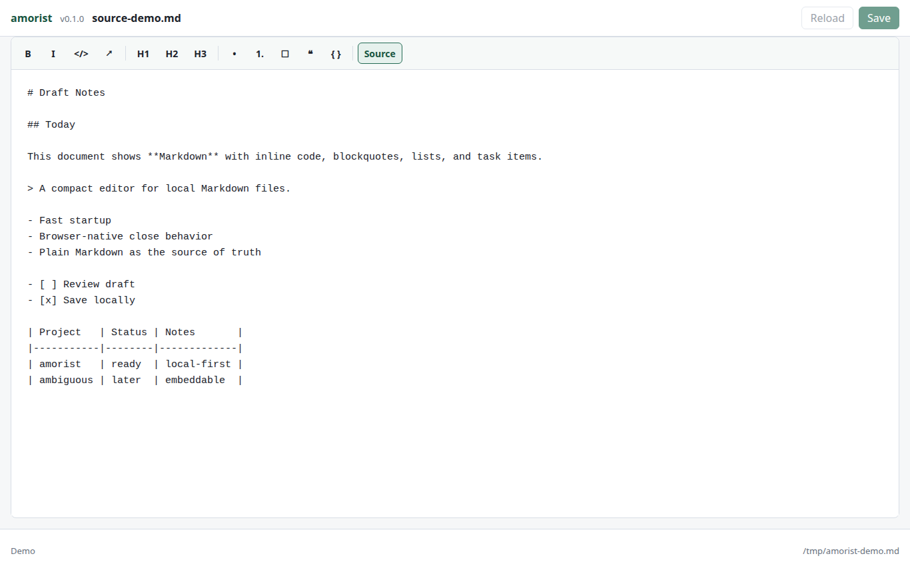
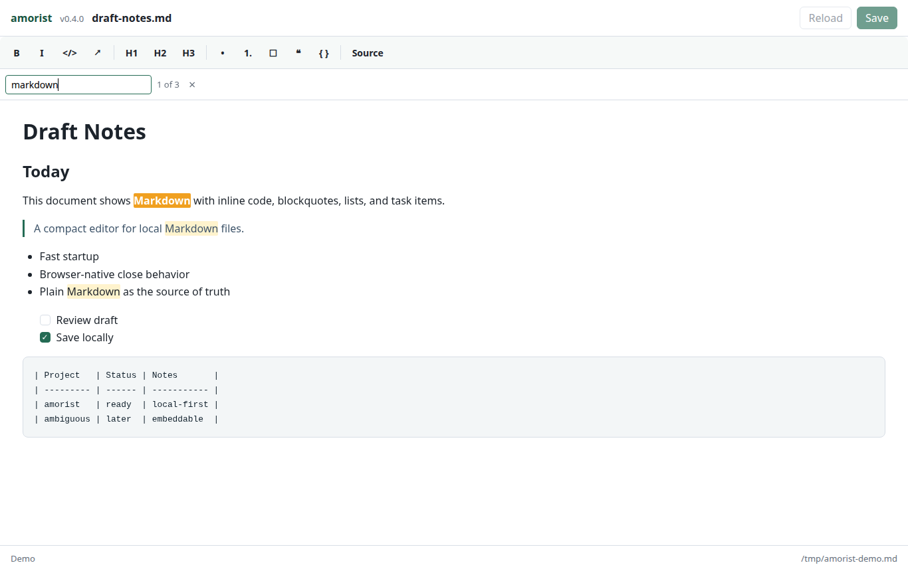

# amorist

Fast local Markdown editing in a native window.

amorist opens one Markdown file at a time:

```bash
amorist file.md
```

The standalone app uses a system webview (Tauri 2) with a Rust backend — single binary, no Python, no Electron. The editor is a small vanilla JavaScript component built for this project, so Markdown stays the source of truth.


| Source mode | Find bar |
|-------------|----------|
|  |  |

## Features

- Opens `.md`, `.markdown`, and `.mdown` files from the command line.
- Saves directly to the same local file with `Ctrl+S` or the Save button.
- Keeps existing `LF` or `CRLF` line endings when saving.
- Undo and redo with full history that survives mode switches.
- In-editor find bar with real-time match highlighting and navigation.
- Warns before closing with unsaved changes; detects external file modifications.
- Supports headings, emphasis, links, code, lists, blockquotes, fenced code blocks, task lists, and readable Markdown tables.
- Converts common Markdown shortcuts while typing (see below).
- Keeps wide tables and fenced code blocks inside horizontally scrollable blocks.
- Rejects files larger than 10 MB before reading.
- Reads and writes Markdown as UTF-8.

## Keyboard Shortcuts

| Shortcut | Action |
|----------|--------|
| `Ctrl+S` | Save |
| `Ctrl+Z` | Undo |
| `Ctrl+Y` / `Ctrl+Shift+Z` | Redo |
| `Ctrl+F` | Open find bar |
| `Enter` | Next match (find bar focused) |
| `Shift+Enter` | Previous match (find bar focused) |
| `Escape` | Close find bar |

On macOS, use `Cmd` instead of `Ctrl`.

## WYSIWYG Shortcuts

In WYSIWYG mode, amorist converts common Markdown markers as you type:

- `# `, `## `, `### ` for headings.
- `- ` and `1. ` for lists.
- `- [ ] ` and `- [x] ` for task lists.
- `> ` for blockquotes.
- Triple backticks followed by Enter for fenced code blocks.
- `` `code` `` for inline code.
- `**bold**` for bold text.

## Tables

Pipe tables are shown as editable monospace Markdown blocks. amorist aligns columns when rendering or saving, counts emoji and other wide glyphs by visual width, preserves escaped pipes like `\|`, and keeps blank lines inside a table when the following non-empty line is still a table row.

Very wide tables scroll horizontally inside their block, so the rest of the document stays readable.

## Install

### Standalone app (recommended)

Prebuilt `.deb` (Linux) and `.dmg` (macOS, universal) packages are attached to each [GitHub release](../../releases).

The macOS `.dmg` is currently unsigned. On first launch, right-click the app in Applications and choose **Open** to bypass the Gatekeeper warning ("amorist cannot be opened because the developer cannot be verified"). After that, normal double-click works.

#### Shell command (`amorist`)

The Linux `.deb` already installs `amorist` into `/usr/bin`. On macOS, the `.app` is GUI-only by default. To get the `amorist` command in your shell, run once after install:

```bash
/Applications/amorist.app/Contents/MacOS/amorist --install-cli
```

This creates a symlink at `~/.local/bin/amorist`. If that directory is not on your `PATH`, the command prints the exact `export` line to add to your shell rc. After that, `amorist file.md` works from anywhere.

#### Desktop integration (Linux)

The `.deb` package registers amorist in your desktop's **Open with** menu for Markdown files automatically (it installs a `.desktop` entry whose launcher passes the file path).

For the portable **AppImage** (no system install), register it at user level once:

```bash
"path/to/amorist_<version>_amd64.AppImage" --install-desktop
```

This writes a `.desktop` entry and icon under `~/.local/share/icons` and `~/.local/share/applications`, so amorist appears under **Open with** for `.md` files. Undo it with `--uninstall-desktop`. To build the AppImage from source, run `./build-appimage.sh`.

On **macOS**, the `.app`/`.dmg` registers the Markdown association and icon with Launch Services automatically when installed — no extra step is needed.

#### Build from source

Requires the Rust toolchain and the Tauri CLI:

```bash
cargo install tauri-cli --version "^2"
```

**Linux:**

```bash
sudo apt install libwebkit2gtk-4.1-dev build-essential curl wget file \
  libxdo-dev libssl-dev libayatana-appindicator3-dev librsvg2-dev
cd src-tauri && cargo tauri build
```

The release binary is at `src-tauri/target/release/amorist`. A `.deb` package is generated in `src-tauri/target/release/bundle/deb/`.

**macOS:**

```bash
xcode-select --install  # Xcode Command Line Tools (one-time)
rustup target add x86_64-apple-darwin aarch64-apple-darwin
cd src-tauri && cargo tauri build --target universal-apple-darwin
```

The universal `.app` is at `src-tauri/target/universal-apple-darwin/release/bundle/macos/amorist.app`. A `.dmg` is generated in `src-tauri/target/universal-apple-darwin/release/bundle/dmg/`.

### Browser mode (deprecated)

amorist can also run as a Python 3 HTTP server that opens the editor in a browser tab. This mode is deprecated and will be removed in a future version.

```bash
./scripts/install.sh
```

The installer runs without confirmation and chooses the install scope from
your effective UID — **the script never escalates privileges**:

- Run as a normal user → installs under `~/.local/share/amorist` and links
  the command at `~/.local/bin/amorist`. If `~/.local/bin` is not on your
  `PATH`, the installer prints the exact `export` line to add to your shell rc.
- Run as root → installs under `/opt/amorist` and links
  `/usr/local/bin/amorist`.

If `file.md` does not exist yet, amorist creates it on the first save.

To remove the installed files:

```bash
./scripts/uninstall.sh
```

## Development

### Standalone app

```bash
cd src-tauri && cargo tauri dev
cd src-tauri && cargo tauri dev -- -- notes.md
```

### Browser mode (deprecated)

```bash
./bin/amorist --no-open file.md
```

Open the printed local URL in a browser. Omit `--no-open` to let amorist call `xdg-open`.

Useful checks:

```bash
node tests/editor-table-codec.test.js
node tests/editor-markdown-codec.test.js
node tests/editor-history.test.js
python3 tests/test_runtime_server.py
python3 -m py_compile bin/amorist
node --check web/app.js
node --check web/editor/amorist-text-utils.js
node --check web/editor/amorist-table-codec.js
node --check web/editor/amorist-markdown-codec.js
node --check web/editor/amorist-editing-policy.js
node --check web/editor/amorist-editor.js
bash -n scripts/install.sh
bash -n scripts/uninstall.sh
bash -n scripts/capture-screenshots.sh
```

Optional browser smoke check:

```bash
AMORIST_RUN_BROWSER_SMOKE=1 node tests/app-shell-smoke.test.js
```

The smoke check starts `./bin/amorist --no-open` against a temporary Markdown file and uses a Chromium-compatible browser if one is available.

## Embedded Editor

The editor lives under `web/editor/`. It is plain browser JavaScript and can be embedded in another vanilla app without a build step:

```html
<link rel="stylesheet" href="amorist-editor.css">
<div id="description-editor"></div>
<script src="amorist-text-utils.js"></script>
<script src="amorist-table-codec.js"></script>
<script src="amorist-markdown-codec.js"></script>
<script src="amorist-editing-policy.js"></script>
<script src="amorist-editor.js"></script>
<script>
  const editor = AmoristEditor.create(document.getElementById("description-editor"), {
    value: "# Notes",
    onChange(markdown) {
      console.log(markdown);
    },
  });

  editor.getMarkdown();
  editor.setMarkdown("Updated **Markdown**");
  editor.showSourceMode();
  editor.showWysiwygMode();
  editor.destroy();
</script>
```

The editor intentionally supports a small Markdown subset: headings, paragraphs, emphasis, inline code, links, blockquotes, bullet lists, numbered lists, task lists, fenced code blocks, and pipe tables. In WYSIWYG mode, common shortcuts are converted as you type; tables are automatically aligned on serialization. Use source mode when exact text control matters.
